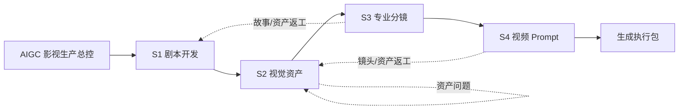

# AIGC 影视生产 Skill 流水线

本仓库是一套面向 AIGC 影视生产的多 Skill 工作流，将剧本开发、视觉资产、专业分镜和视频 Prompt 串成可恢复、可审计、可返工的完整流程。

仓库按“总控 + 阶段编排器 + 专业叶子能力”组织。请克隆或打开完整仓库使用；部分编排器通过相对路径引用相邻阶段文件，不应只复制单个文件夹运行。

## 生产流程



各阶段使用统一工件编号、锁定状态和质量闸门。下游发现上游问题时必须登记并回退，不能在下游静默改写。

## 快速开始

1. 从 [`aigc-production-orchestrator/SKILL.md`](aigc-production-orchestrator/SKILL.md) 进入。
2. 提供已有材料：创意、项目档案、剧本、资产、分镜或视频 Prompt 均可。
3. 总控盘点材料并判断应从 S1–S4 的哪个阶段接管。
4. 需要持久化状态时创建项目账本：

```bash
python3 aigc-production-orchestrator/scripts/pipeline_state.py init \
  --project-id DEMO01 \
  --title "项目名称" \
  --output pipeline-state.json
```

检查状态和下一阶段：

```bash
python3 aigc-production-orchestrator/scripts/pipeline_state.py check pipeline-state.json
python3 aigc-production-orchestrator/scripts/pipeline_state.py next pipeline-state.json
```

## 目录结构

```text
.
├── README.md
├── aigc-production-orchestrator/       # 全流程总控与状态机
├── 01作剧/                              # 项目建档、写作、节奏、会诊、台词
│   └── script-development-pipeline/    # S1 阶段编排器
├── 02作图/                              # 资产提取、人物、环境与 VFX
│   └── visual-asset-pipeline/          # S2 阶段编排器
├── 03分镜/
│   └── professional-script-to-storyboard/ # S3 阶段编排器
└── 04视频/
    └── video-prompt-pipeline/          # S4 阶段编排器
```

中文阶段目录用于团队阅读；真正的 Skill 文件夹保持英文小写连字符命名，并与 `SKILL.md` 的 `name` 一致。

## 主要入口

| 层级 | 入口 | 职责 |
|---|---|---|
| 总控 | [`aigc-production-orchestrator`](aigc-production-orchestrator/SKILL.md) | 阶段判断、工件锁定、质量闸门、版本与返工路由 |
| S1 | [`script-development-pipeline`](01作剧/script-development-pipeline/SKILL.md) | 编排创作、写作、节奏、会诊、返稿和台词精修 |
| S2 | [`visual-asset-pipeline`](02作图/visual-asset-pipeline/SKILL.md) | 提取并锁定人物、场景、道具和 VFX 资产 |
| S3 | [`professional-script-to-storyboard`](03分镜/professional-script-to-storyboard/SKILL.md) | 剧本转专业分镜、连续性审计和 AI 执行层 |
| S4 | [`video-prompt-pipeline`](04视频/video-prompt-pipeline/SKILL.md) | 分镜与资产转文生/图生视频 Prompt 包 |

## 标准工件

| 阶段 | 工件 |
|---|---|
| S1 | `P01` 项目档案、`S01` 制作锁定剧本、`S02` 修订记录 |
| S2 | `A01` 资产总表、`A02` 人物、`A03` 场景、`A04` 道具、`A05` VFX |
| S3 | `B01` 镜头母版、`B02` 连续性账本、`B03` 宫格故事版 |
| S4 | `V01` 视频风格锁、`V02` Prompt 包、`V03` 生成清单 |

完整工件、闸门和影响矩阵见 [`pipeline-contract.md`](aigc-production-orchestrator/references/pipeline-contract.md)。

## 分镜节奏

专业分镜支持以下节奏模式：

- `RESTRAINED`：克制叙事；
- `CLASSIC`：连续性和戏剧节拍优先；
- `COMMERCIAL`：商业短剧；
- `COMMERCIAL_FAST`：晚进早出、限制 coverage、控制镜头预算；
- `ACTION`：动作空间和打击反馈优先。

校验 Markdown 分镜：

```bash
python3 03分镜/professional-script-to-storyboard/scripts/validate_storyboard.py \
  path/to/storyboard.md
```

## Skill 结构约定

每个正式 Skill 使用以下最小结构：

```text
skill-name/
├── SKILL.md
├── agents/
│   └── openai.yaml
├── references/    # 按需
├── scripts/       # 按需
└── assets/        # 按需
```

- Skill 文件夹只用小写英文、数字和连字符。
- 单个 Skill 内不增加 README、安装指南或重复说明；仓库级说明统一放在本文件。
- `SKILL.md` 保持精简，详细规则放在 `references/`。
- 可重复、易出错的机械操作放在 `scripts/` 并实际测试。
- 模板和视觉参考放在 `assets/`。

## 命名约定

- 阶段目录允许中文，例如 `01作剧`、`03分镜`。
- 普通文档允许中文，但文件名不使用空格，例如 `01-剧本创作.md`。
- 稳定 Skill 名保持英文，例如 `professional-script-to-storyboard`。
- 镜号使用 `Sxx-Bxx-Cxx`；工件版本使用 `<ID>-v<major>.<minor>`。
- 移动或改名文件后必须同步更新所有 Markdown 相对链接。

## Git 与跨平台约定

- 文本文件统一 UTF-8、LF 换行和文件末尾换行。
- `.DS_Store`、Python 缓存、虚拟环境、日志和临时文件不提交。
- PNG、JPEG、PDF 等资产按二进制文件管理，不做文本差异比较。
- 中文路径受 Git 支持；命令行引用路径时建议始终加引号。
- 提交前运行 Skill 结构校验和相关脚本测试。

## 许可证

本仓库目前尚未声明开源许可证。公开发布前请根据使用范围选择许可证；私有仓库可保持未声明状态。
